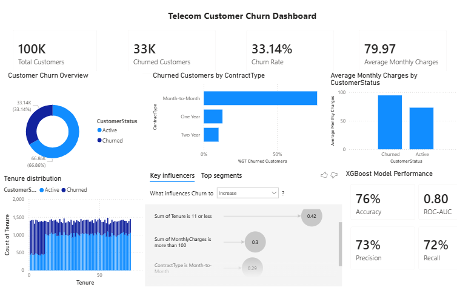

# Customer Churn Prediction & Retention Analytics

An end-to-end customer churn analytics project using Python, machine learning and Power BI to identify customers at higher risk of churn and translate analytical findings into customer-retention recommendations.

## Project Overview

Customer churn is an important business problem because identifying customers who are likely to leave can help organisations develop targeted retention strategies.

This project analyses approximately **100,000 customer records** to explore patterns associated with customer churn and develop predictive classification models.

The project combines exploratory data analysis, feature selection, machine learning, model evaluation and business intelligence reporting.

## Objectives

- Explore customer characteristics and patterns associated with churn.
- Identify customer segments with higher churn risk.
- Build and compare classification models.
- Evaluate model performance using accuracy, precision, recall and ROC-AUC.
- Identify practical customer-retention opportunities.
- Communicate findings through a Power BI dashboard.

## Tools & Technologies

- **Python**
- **Jupyter Notebook**
- **Pandas**
- **NumPy**
- **Scikit-learn**
- **XGBoost**
- **Matplotlib**
- **Power BI**

## Dataset

The project uses approximately **100,000 customer records** containing customer and account-related variables, including:

- Contract type
- Customer tenure
- Monthly charges
- Other customer characteristics

The analysis focuses on identifying patterns associated with customer churn.

## Analysis Approach

### 1. Exploratory Data Analysis

The data was explored to understand:

- Customer and account characteristics
- Churn distribution
- Churn patterns across customer segments
- Relationships between customer attributes and churn

### 2. Data Preparation

The analysis included:

- Reviewing the dataset structure and variables
- Preparing features for modelling
- Removing selected features that were not considered useful for the modelling process
- Preparing the data for classification

### 3. Feature Selection

Feature selection was used to remove selected variables and focus the modelling process on relevant information.

### 4. Model Development

Two classification models were developed and evaluated:

- **Logistic Regression**
- **XGBoost**

Hyperparameter tuning was performed with the aim of balancing precision and recall.

## Model Performance

| Model | Accuracy | ROC-AUC |
|---|---:|---:|
| Logistic Regression | 69% | 0.77 |
| XGBoost | **76%** | **0.80** |

XGBoost produced stronger overall performance than Logistic Regression based on the evaluation results.

The XGBoost model also achieved:

- **Precision:** 73%
- **Recall:** 72%

## Key Findings

The analysis identified several patterns associated with customer churn:

- Customers with **shorter tenure** showed higher churn risk.
- Customers on **monthly contracts** represented an important higher-risk segment.
- **Monthly charges** were associated with differences in churn behaviour.
- Customer characteristics showed different levels of association with churn.

## Business Recommendation

Based on the analysis, customers on **monthly contracts with shorter tenure** should be considered a priority segment for targeted retention activity.

Potential actions could include:

- Targeted retention campaigns
- Early engagement with newer customers
- Offers or incentives for customers at higher risk of churn
- Monitoring high-risk customer segments using data-driven indicators

The aim is to help prioritise retention activity using customer data rather than applying the same approach to all customers.

## Power BI Dashboard

The project includes a Power BI dashboard for communicating customer churn patterns and model performance.

## Model Notebooks

### Logistic Regression

[View the Logistic Regression notebook](notebooks/logistic_regression.ipynb)

### XGBoost

[View the XGBoost notebook](notebooks/xgboost_model.ipynb)

## Skills Demonstrated

- Python data analysis
- Exploratory data analysis
- Data preparation
- Feature selection
- Classification modelling
- Logistic Regression
- XGBoost
- Hyperparameter tuning
- Model evaluation
- Precision and recall analysis
- Data visualisation
- Power BI
- Translating analytical findings into business recommendations

Conclusion

This project demonstrates an end-to-end approach to customer churn analytics, from exploring customer data and developing predictive models to identifying higher-risk customer segments and translating findings into practical retention recommendations.
